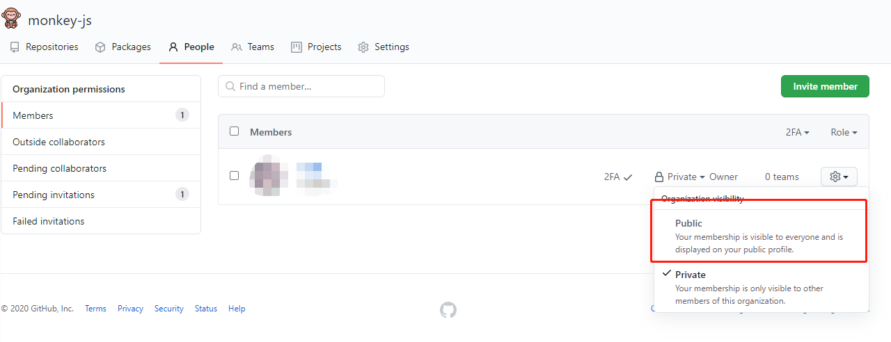

[简体中文](./how-to-show.md) | English

## How to show

### 1. Fill out the application

Create a new [issue](https://github.com/zoo-js/zoo/issues/new/choose) and fill in the application.

When the application meets the specifications, you will be invited to join the organization. You will see an invitation link in the main GitHub mailbox.

### 2. Accept invitation

Click join in the mailbox to accept the invitation.

### 3. Cute pet display

After successfully joining the organization, you can see the cute pet at the bottom left of the personal overview page **Organizations**.

Due to GitHub's default settings, the organization information will not be displayed when joining the organization for the first time. That is, other people cannot see your cute pet icon.

#### How to show it to the outside?

- Click the icon to enter the organization page
- Click **People** to enter the personnel interface
- Find your own and change to **Public**

### 4. Personal guidelines

1. After you confirm the invitation, it is recommended to close the issue yourself.
2. Harmony, politics、obscenity、etc. are prohibited.

[🔔 Back to home](./README.en-US.md)
